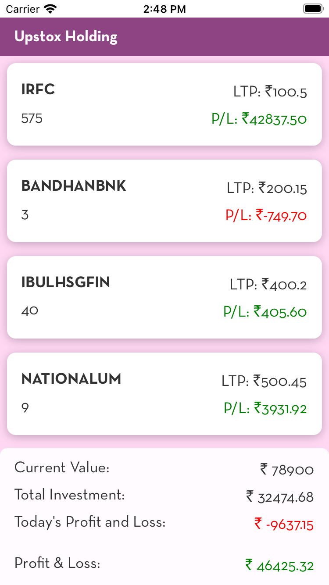

# Introduction
This application is used for showing the list of stocks with API calls.

# Library Used
- [Maestro](https://maestro.mobile.dev/platform-support/react-native)For UI testing 
- [React Native Testing Library](https://callstack.github.io/react-native-testing-library/) 

# Learn More

To learn more about React Native, take a look at the following resources:

- [React Native Website](https://reactnative.dev) - learn more about React Native.
- [Learn the Basics](https://reactnative.dev/docs/getting-started) - a **guided tour** of the React Native **basics**.
- [Testing](https://reactnative.dev/docs/testing-overview)- a guide for writing test cases

  # Screenshot
    

